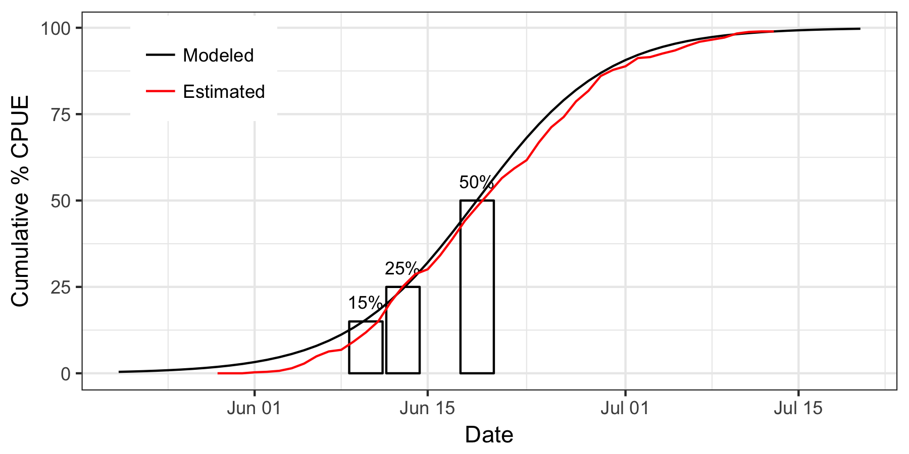

# 2017-yukon-forecasting

Data, code, and output for the 2017 operational forecast of Yukon River Chinook salmon run timing

```{r, echo=FALSE, message=FALSE}
library(knitr)
library(readr)
predictions <- suppressWarnings({read_csv("may_forecast/predictions.csv")})
predictions$percentile <- c("15%", "25%", "50%")
```


## Forecasted Timing of Percentiles of Cumulative CPUE
```{r, echo=FALSE}
kable(predictions, col.names = c("Percentile", "Predicted Date (Day of June)"))
```

### Latest Daily Forecast

The red line should match the black line pretty well when the forecast is reasonable.



### Final CPUE Heuristic

This line should be erratic early on in the run by smooth out and oscillate around a single value of final CPUE when the forecast is reasonable.


