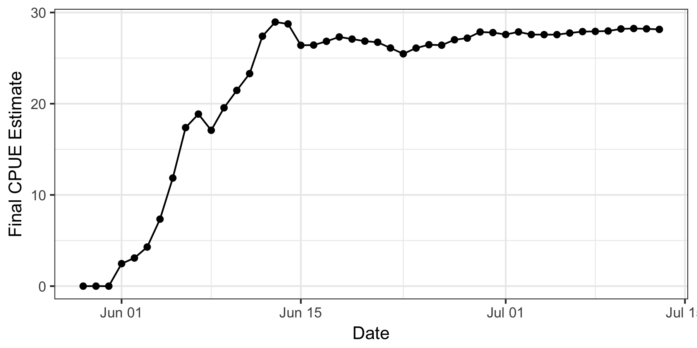

2017-yukon-forecasting
======================

Data, code, and output for the 2017 operational forecast of Yukon River
Chinook salmon run timing

Forecasted Timing of Percentiles of Cumulative CPUE
---------------------------------------------------

<table>
<thead>
<tr class="header">
<th align="left">Percentile</th>
<th align="right">Predicted Date (Day of June)</th>
</tr>
</thead>
<tbody>
<tr class="odd">
<td align="left">15%</td>
<td align="right">10</td>
</tr>
<tr class="even">
<td align="left">25%</td>
<td align="right">13</td>
</tr>
<tr class="odd">
<td align="left">50%</td>
<td align="right">19</td>
</tr>
</tbody>
</table>

### Latest Daily Forecast

The red line should match the black line pretty well when the forecast
is reasonable.

### Final CPUE Heuristic

This line should be erratic early on in the run by smooth out and
oscillate around a single value of final CPUE when the forecast is
reasonable.

